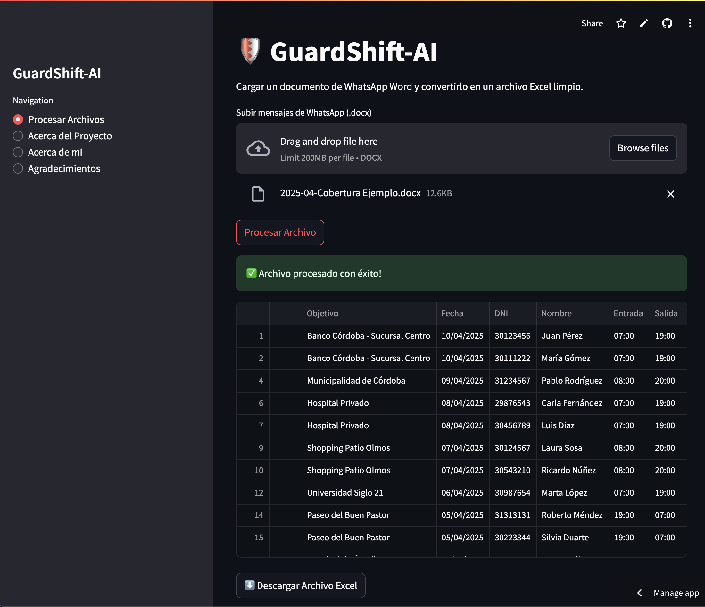
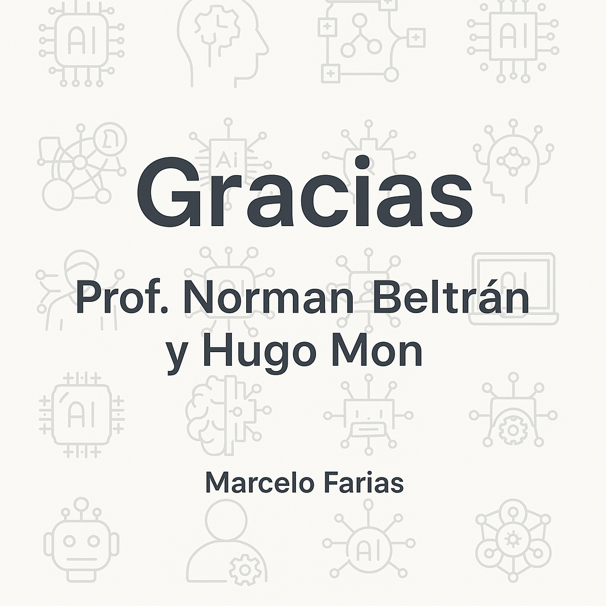

# 🛡️ GuardShift-IA

[](https://guardshift-ai.streamlit.app)

**GuardShift-IA** es una aplicación web que utiliza Inteligencia Artificial para automatizar el procesamiento de turnos laborales registrados a través de mensajes de WhatsApp. Desarrollada con Python, Streamlit y Gemini 1.5 Flash, transforma mensajes copiados en un archivo Word en una planilla Excel limpia y lista para usar.

---

## 📋 Menú

- [🚀 Link de la aplicación](#-link-de-la-aplicación)
- [🔍 PARA REALIZAR LA PRUEBA](#-para-realizar-la-prueba)
- [🧠 ¿Qué problema resuelve?](#-qué-problema-resuelve)
- [🤖 ¿Qué hace GuardShift-IA?](#-qué-hace-guardshift-ia)
- [👆🏻 Relevancia](#-relevancia)
- [🔧 Tecnologías utilizadas](#-tecnologías-utilizadas)
- [📥 Instalación local (opcional)](#-instalación-local-opcional)
- [📂 Estructura del proyecto](#-estructura-del-proyecto)
- [🙏 Agradecimientos](#-agradecimientos)
- [👨‍💻 Autor](#-autor)
- [🛡️ Licencia](#-licencia)

---

## 🚀 Link de la aplicación

👉 **[guardshift-ai.streamlit.app](https://guardshift-ai.streamlit.app)**

[🔝 Volver al menú](#-menú)

---

## 🔍 PARA REALIZAR LA PRUEBA

En este repositorio se incluye un documento de ejemplo llamado:

📄 **[2025-04-Cobertura Ejemplo.docx](./2025-04-Cobertura%20Ejemplo.docx)**

Este archivo simula el archivo real que la empresa **RF Seguridad** construye en base a los mensajes recibidos por WhatsApp para registrar los turnos del personal.  
Podés usar este archivo para hacer pruebas y comprobar cómo la aplicación extrae la información y genera automáticamente un Excel organizado.

🔽 **Descargá el archivo desde el enlace anterior (selecciona "view raw" para descarlo), o bien desde este mismo repositorio y usalo en la sección “Process Files” de la aplicación.**

[🔝 Volver al menú](#-menú)

---

## 🧠 ¿Qué problema resuelve?

En **RF Seguridad**, una empresa de seguridad privada, el personal informa sus turnos mediante mensajes de WhatsApp, Estos mensajes son transcritos a un documento word y contienen información clave sobre el servicio prestado:

- 📍 Objetivo (lugar de trabajo)
- 📅 Fecha
- 🕒 Horario
- 👮‍♂️ Nombre y DNI del vigilador
- 🧑‍💼 Supervisor

Ejemplo:

```
=============
Objetivo: Banco Córdoba - Sucursal Centro
Fecha: 10/04/2025
DNI 30123456 Juan Pérez 07 a 19
DNI 30111222 María Gómez 07 a 19
Supervisor: Sargento Arce
=============
```

El proceso actual implica extraer manualmente la información de estos mensajes y registrarla en una planilla de Excel, que después alimenta el sistema de liquidación de sueldos. Este método es lento ya que requiere mucho tiempo de carga, propenso a errores y consume tiempo valioso que podría destinarse a otras tareas de gestión y control..

[🔝 Volver al menú](#-menú)

---

## 🤖 ¿Qué hace GuardShift-IA?

1. **Subís un archivo Word (.docx)** con los mensajes de WhatsApp copiados.
2. La IA analiza y extrae los datos estructurados.
3. Se genera una **planilla Excel (.xlsx)** con la información organizada y lista para usar.

<p align="center">
  
</p>

[🔝 Volver al menú](#-menú)

---

## 👆🏻 Relevancia

El proyecto GUARDSHIFT-AI es relevante porque resuelve una problemática real en la empresa RF Seguridad: la carga manual de registros de horas de trabajo a partir de mensajes de WhatsApp.

La automatización con IA no solo agiliza el procesamiento de la información, sino que también minimiza los errores humanos, mejora la organización de los datos y permite generar reportes de manera eficiente.

[🔝 Volver al menú](#-menú)

---

## 🔧 Tecnologías utilizadas

 Como asistente de desarrollo de IA integrado con Microsoft Visual Studio Code, que proporciona una interfaz que facilita la creación de código basado en prompts introducidos por el usuario.
 Como lenguaje de programación de alto nivel, interpretado y de código abierto. Python es una de las opciones más populares para el desarrollo de aplicaciones de inteligencia artificial.
 Como una biblioteca de Python de código abierto que permite crear aplicaciones web interactivas. Streamlit es una herramienta que permite desarrollar aplicaciones web de manera rápida y fácil.
 Como una biblioteca de Python de código abierto que permite la creación de aplicaciones de inteligencia artificial.
 Como formato de archvio de entrada.
 Como formato de archvio de salida.
 Como una biblioteca de Python de código abierto que permite manipular y analizar datos estructurados.

- **Otras Librerías clave**:
  - `python-docx`
  - `re`
  - `tempfile`
  - `datetime`
  - `os`

[🔝 Volver al menú](#-menú)

---

## 📥 Instalación local (opcional)

```bash
# 1. Clonar el repositorio
git clone https://github.com/hmfarias/GuardShift-IA.git
cd GuardShift-IA

# 2. Crear entorno virtual (opcional)
python -m venv venv
source venv/bin/activate  # o venv\Scripts\activate en Windows

# 3. Instalar dependencias
pip install -r requirements.txt

# 4. Configurar la clave de API de Gemini
# Crear archivo .streamlit/secrets.toml con el siguiente contenido:

[GOOGLE_API_KEY]
GOOGLE_API_KEY = "TU_API_KEY_AQUÍ"

# 5. Ejecutar la app
streamlit run app.py
```

[🔝 Volver al menú](#-menú)

---

## 📂 Estructura del proyecto

```
GuardShift-IA/
├── guardshift_app.py     # Código principal de la aplicación
├── requirements.txt      # Dependencias del proyecto
├── .gitignore            # Exclusión de archivos sensibles o temporales
├── README.md             # Documentación del proyecto
├── 2025-04-Cobertura Ejemplo.docx # Archivo de ejemplo para testeo
└── .streamlit/
    └── secrets.toml      # Archivo con la API Key de Gemini
```

[🔝 Volver al menú](#-menú)

---

## 🙏 Agradecimientos

Quiero expresar un especial agradecimiento a Norman Beltrán, profesor de la materia Inteligencia Artificial: Prompt Engineering para Programadores, y al tutor Hugo Mon, por su dedicación y acompañamiento.

Gracias por brindarnos el puntapié inicial en el mundo de la Inteligencia Artificial y guiarnos con tanta predisposición en este camino tan valioso para todo programador.

<p align="center">
  
</p>

[🔝 Volver al menú](#-menú)

---

## 👨‍💻 Autor

Marcelo Farias
• LinkedIn
• GitHub

[🔝 Volver al menú](#-menú)

---

## 🛡️ Licencia

Este proyecto está bajo la Licencia MIT.
© 2025 Marcelo Farias

[🔝 Volver al menú](#-menú)
